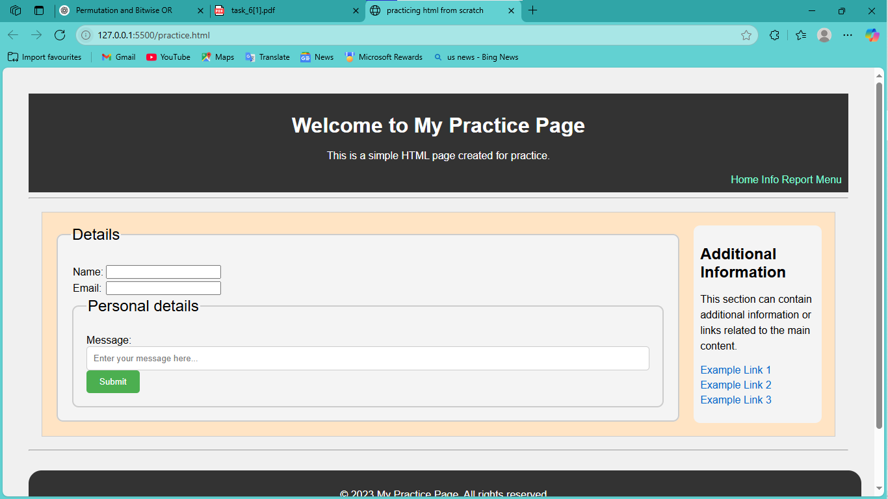

# 🧾 Form Validation Using HTML, CSS, and JavaScript

This project demonstrates a responsive **HTML form** with **client-side validation** using JavaScript. It validates user inputs such as name and email before submission and provides real-time feedback.

---

## 📸 Screenshots

### Default View:

### Feedback:

### Sucessfull submission:

## 🚀 Features

- ✅ Responsive form layout (mobile-friendly)
- ✅ Name validation using RegEx (starts with capital letter)
- ✅ Email validation using RegEx
- ✅ Live error highlighting with red borders
- ✅ Success feedback with green borders
- ✅ Prevents form submission if fields are invalid
- ✅ Clear error messages via placeholder text

---

## 🛠 Technologies Used

- **HTML5**
- **CSS3**
- **JavaScript (Vanilla)**

